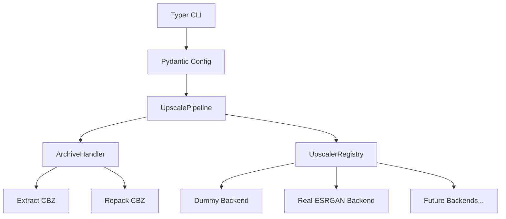

# CBZ Upscale 🖼️🚀

[](https://www.python.org/downloads/)
[](https://opensource.org/licenses/MIT)

A professional, portfolio-grade CLI tool for batch upscaling comic book archives (`.cbz`) using AI. 

Built with modern Python tools: **Typer** (CLI), **Rich** (UX), **Pydantic** (Configuration), and an extensible plugin-based architecture.

## ✨ Features

- **End-to-End Pipeline**: Automatically extracts the CBZ, upscales the images, and repacks them back into a new CBZ archive.
- **Pluggable Architecture**: Easily extendable with new AI upscaler backends. Currently supports `realesrgan-ncnn-vulkan`.
- **Metadata Preservation**: Safely handles and preserves `ComicInfo.xml` and other non-image metadata during the repacking process.
- **Smart Progress Tracking**: Real-time Rich UI progress bars with reliable file-polling to track multi-GPU upscaling without deadlocks.
- **Flexible Configuration**: Configure settings via command-line arguments, a `.yaml` config file, or a combination of both.
- **Batch Processing**: Point it at a single `.cbz` file or an entire directory of archives.

## 📦 Installation

This project uses `hatchling` as the build backend. 

To install the tool globally (or in a virtual environment):

```bash
git clone https://github.com/your-username/cbz-upscale.git
cd cbz-upscale
pip install -e .
```

To install development dependencies (for testing):
```bash
pip install -e ".[dev]"
```

## 🚀 Usage

### The Basics

Get help and see available commands:
```bash
cbz-upscale --help
```

List available AI upscaler backends:
```bash
cbz-upscale --list-upscalers
```

### 1. Using CLI Without a Config File

You can run the tool purely via command-line arguments by explicitly specifying the upscaler backend as the command (e.g., `realesrgan` or `dummy`).

**Basic upscaling:**
```bash
cbz-upscale realesrgan my_comic.cbz
```

**Advanced batch upscaling:**
Upscale an entire directory of comics, utilizing 2 GPUs, Test-Time Augmentation (TTA), and specific tile sizes:
```bash
cbz-upscale realesrgan ./comics/ --gpu-id 0,1 --tta --tile-size 0,0
```

*Note: To use the `realesrgan` backend, the `realesrgan-ncnn-vulkan` executable must be in your `PATH`, or you must specify its location via `--exe-path`.*

### 2. Configuration via YAML (Recommended)

Instead of passing long lists of arguments every time, you can use a YAML configuration file. This is highly recommended for batch processing or custom GPU setups.

**Generate a default `config.yaml`:**
```bash
cbz-upscale --init-config
```
This will create a `config.yaml` in your current directory. You can edit this file to permanently set your preferred `exe_path`, `threads`, `gpu_id`, etc.

### 3. Using the `auto` Command

Once you have set up your `config.yaml`, you no longer need to type the backend name in the CLI. You can use the `auto` command, which automatically reads the `upscaler` field from your config file.

**Run using config settings:**
```bash
cbz-upscale auto "C:/comics/input" -c config.yaml -o "C:/comics/output"
```
The tool will automatically use the upscaler defined in `config.yaml` (e.g., `upscaler: realesrgan`) and apply all its specific settings.

*Note: Any explicit CLI arguments you pass will always override the settings found in the YAML file!*

## 🧩 Architecture

The project uses a **Registry Pattern** to allow easy creation and addition of new upscaler backends.



### Adding a New Backend

Adding a new upscaler (e.g., `waifu2x`) is easy:
1. Create a new settings class inheriting from `UpscalerSettings` in `config.py`.
2. Add it to `AppConfig`.
3. Create a new class inheriting from `BaseUpscaler` in `src/cbz_upscale/upscalers/waifu2x.py`.
4. Decorate it with `@UpscalerRegistry.register`.
5. Implement `validate_environment()` and `upscale_directory()`.
6. Add the CLI subcommand in `cli.py`.

## 🙏 Acknowledgments

This project relies on the incredible work of the open-source AI upscaling community. Special thanks to:

- **[Real-ESRGAN](https://github.com/xinntao/Real-ESRGAN)** by xinntao for the core upscaling algorithms.
- **[realesrgan-ncnn-vulkan](https://github.com/xinntao/Real-ESRGAN-ncnn-vulkan)** by xinntao and nihui for the ultra-fast, cross-platform Vulkan implementation.

## 📄 License

This project is licensed under the MIT License - see the [LICENSE](LICENSE) file for details.
