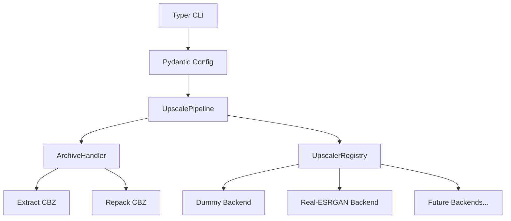

# CBZ Upscale 🖼️🚀

[](https://www.python.org/downloads/)
[](https://opensource.org/licenses/MIT)

A professional, portfolio-grade CLI tool for batch upscaling comic book archives (`.cbz`) using AI. 

Built with modern Python tools: **Typer** (CLI), **Rich** (UX), **Pydantic** (Configuration), and an extensible plugin-based architecture.

## ✨ Features

- **End-to-End Pipeline**: Automatically extracts the CBZ, upscales the images, and repacks them back into a new CBZ archive.
- **Pluggable Architecture**: Easily extendable with new AI upscaler backends. Currently supports `realesrgan-ncnn-vulkan`.
- **Metadata Preservation**: Safely handles and preserves `ComicInfo.xml` and other non-image metadata during the repacking process.
- **Smart Progress Tracking**: Real-time Rich UI progress bars with reliable file-polling to track multi-GPU upscaling without deadlocks.
- **Flexible Configuration**: Configure settings via command-line arguments, a `.yaml` config file, or a combination of both.
- **Batch Processing**: Point it at a single `.cbz` file or an entire directory of archives.

## 📦 Installation

This project uses `hatchling` as the build backend. 

To install the tool globally (or in a virtual environment):

```bash
git clone https://github.com/your-username/cbz-upscale.git
cd cbz-upscale
pip install -e .
```

To install development dependencies (for testing):
```bash
pip install -e ".[dev]"
```

## 🚀 Usage

### The Basics

Get help and see available commands:
```bash
cbz-upscale --help
```

List available AI upscaler backends:
```bash
cbz-upscale --list-upscalers
```

### Real-ESRGAN Upscaling

To use the Real-ESRGAN backend, you must have the `realesrgan-ncnn-vulkan` executable installed and available in your `PATH` (or provide the path to it).

Upscale a single comic file:
```bash
cbz-upscale realesrgan my_comic.cbz
```

Upscale an entire directory of comics, utilizing 2 GPUs and Test-Time Augmentation (TTA):
```bash
cbz-upscale realesrgan ./comics/ --gpu-id 0,1 --tta
```

Specify custom scaling and model:
```bash
cbz-upscale realesrgan my_comic.cbz --scale 3 --model realesrgan-x4plus
```

### Configuration via YAML

Instead of passing long lists of arguments, you can use a YAML configuration file.

Generate a default `config.yaml` in the current directory:
```bash
cbz-upscale --init-config
```

Run using the config file:
```bash
cbz-upscale realesrgan my_comic.cbz -c config.yaml
```

CLI arguments always override settings found in the YAML file!

## 🧩 Architecture

The project uses a **Registry Pattern** to allow easy creation and addition of new upscaler backends.



### Adding a New Backend

Adding a new upscaler (e.g., `waifu2x`) is easy:
1. Create a new settings class inheriting from `UpscalerSettings` in `config.py`.
2. Add it to `AppConfig`.
3. Create a new class inheriting from `BaseUpscaler` in `src/cbz_upscale/upscalers/waifu2x.py`.
4. Decorate it with `@UpscalerRegistry.register`.
5. Implement `validate_environment()` and `upscale_directory()`.
6. Add the CLI subcommand in `cli.py`.

## 📄 License

This project is licensed under the MIT License - see the [LICENSE](LICENSE) file for details.
